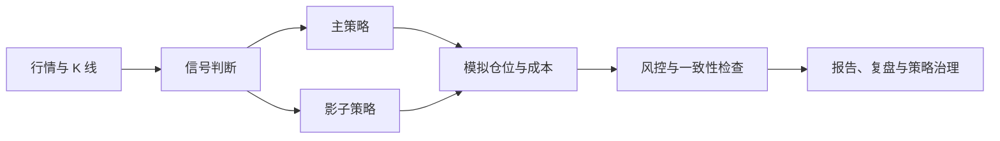

# Kronos Multi-Stock

面向 A 股多标的（最初以 **603305** 为模板）的多空模拟策略研究系统。

本项目基于开源项目 [Kronos](https://github.com/shiyu-coder/Kronos) 进行定制，在 K 线基础模型之外，增加了规则驱动的信号、主/影子策略、模拟仓位、交易成本、风险控制、自动报告、复盘和治理工具。

> **重要声明**：本项目仅用于研究、学习和模拟验证，不连接券商，不执行真实下单，不构成投资建议。任何策略调整都应经过回测、观察、归因和人工确认。

## 项目目标

Kronos Multi-Stock 不是一条孤立的买卖公式，而是一套可复核的研究流程：



核心目标：

- 将行情状态映射为统一、可解释的信号；
- 使用固定规则管理模拟仓位，减少主观漂移；
- 同时运行主策略与影子策略，保证对照公平；
- 纳入佣金、印花税、过户费等成本口径；
- 记录动作、原因、仓位和结果，形成可审计闭环；
- 先积累样本，再依据数据决定是否升级策略。

## 核心能力

### 1. 信号与动作

根据昨收、今开、最高、最低、现价和涨跌幅等信息，生成强多、偏多、中性、偏空、强空等信号，并映射为加仓、减仓或持仓不变。

### 2. 主策略与影子策略

主策略用于当前模拟执行，影子策略用于验证候选参数。二者在同一时点运行，以减少数据口径和时间差造成的偏差。

### 3. 模拟仓位与成本

系统跟踪模拟仓位、建仓均价、毛浮盈、净浮盈和累计成本，并支持多空方向与跨零仓位变化。

### 4. 风控与治理

包含止盈、回撤约束、交易日历、样本质量、速率限制、输出一致性和异常追踪等检查。策略参数变更应先进入影子策略观察，再决定是否升级。

### 5. 报告与复盘

盘中生成统一格式回报，收盘后汇总主/影子策略状态、触发明细、胜率、成本和差异，支持后续归因分析。

## 关键文件

| 文件或目录 | 用途 |
| --- | --- |
| `simulate_position_603305.py` | 主策略模拟执行 |
| `simulate_position_603305_shadow.py` | 影子策略模拟执行 |
| `auto_report_guard_603305.py` | 主/影统一执行、格式化和一致性检查 |
| `sim_review_603305.py` | 收盘复盘 |
| `simulate_rules_603305.json` | 主策略规则参数 |
| `signal_rules_603305.json` | 信号阈值与文案规则 |
| `strategy_versions/` | 影子策略规则及版本记录 |
| `scripts/` | 自动运行、复盘、校验和治理工具 |
| `config/` | 交易日历、因子权重和时点约束 |
| `audit/` | 审计与验证记录 |

## 文档入口

- [603305纯模拟使用说明](README_603305_SIM.md)
- [Kronos Multi-Stock项目说明书 v1.1](KRONOS_项目说明书_v1.1.md)
- [中文目录说明](README_ZH_STRUCTURE.md)
- [策略执行SOP](STRATEGY_SOP_603305_v2026-04-29-v1.md)
- [参数速查](PARAM_QUICK_REF_603305.md)
- [系统契约](KRONOS_SYSTEM_CONTRACT.md)
- [治理基线](KRONOS_GOVERNANCE_BASELINE_v0.3.md)
- [速率限制策略](KRONOS_RATE_LIMIT_POLICY.md)

## 快速开始

### 1. 获取代码

```bash
git clone https://github.com/yifanliu92/Kronos-Multi-Stock.git
cd Kronos-Multi-Stock
```

### 2. 创建Python环境

建议使用 Python 3.10 或更高版本：

```bash
python3 -m venv .venv
source .venv/bin/activate
pip install -r requirements.txt
```

### 3. 阅读策略规则

首次运行前，请先阅读：

```text
README_603305_SIM.md
KRONOS_项目说明书_v1.1.md
STRATEGY_SOP_603305_v2026-04-29-v1.md
```

### 4. 手动模拟运行

```bash
python3 simulate_position_603305.py
python3 simulate_position_603305_shadow.py
python3 sim_review_603305.py
```

不同环境的数据源和状态初始化方式可能不同。请勿在不了解配置和输入数据的情况下，将脚本用于任何真实交易流程。

## Telegram配置

机器人令牌和聊天编号不得写入仓库。自动通知脚本从本机私有文件读取配置：

```text
~/.config/kronos/telegram.env
```

示例格式：

```bash
BOT_TOKEN='your_bot_token'
CHAT_ID='your_chat_id'
```

设置为仅当前用户可读写：

```bash
chmod 600 ~/.config/kronos/telegram.env
```

不要提交真实令牌、聊天编号、`.env` 文件、交易流水或账户信息。

## 数据与隐私

公开仓库主要保存代码、规则、配置模板和文档。以下内容应保留在本地，并已通过 `.gitignore` 排除：

- Python虚拟环境；
- 令牌、密码和本机启动配置；
- 交易状态、流水和个人数据；
- 日志、报告、任务队列和临时输出；
- 备份、归档及Office临时文件。

## 与上游Kronos的关系

本仓库是在 [shiyu-coder/Kronos](https://github.com/shiyu-coder/Kronos) 基础上的定制研究项目。上游Kronos提供金融K线基础模型、Tokenizer、预测模型及相关训练与推理能力；本仓库新增的多标的策略层（以603305为模板，可扩展到任意A股代码）、模拟执行、报告和治理工具并非上游项目的官方功能。

如需了解基础模型的论文、模型权重和通用预测方法，请访问上游项目。

## 许可证

本仓库沿用根目录中的 [MIT License](LICENSE)。使用和分发时请保留相应的版权及许可证声明。

## 风险提示

历史回测、模拟胜率和影子策略表现均不代表未来收益。金融市场存在价格、流动性、模型、数据和执行风险；本项目不提供任何收益承诺。
